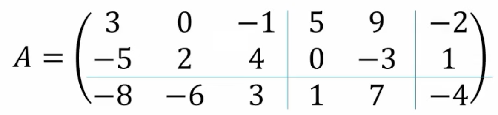
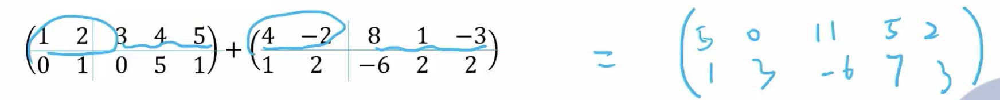
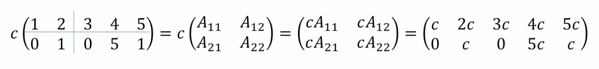
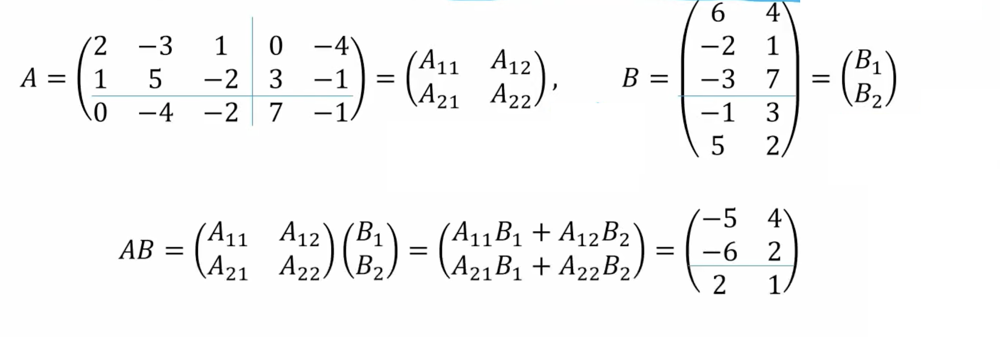
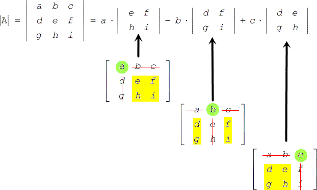
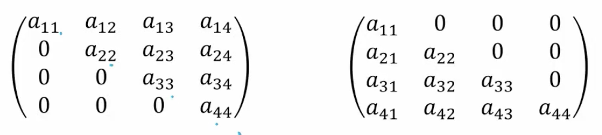

# Chapter 4. 线性代数

## 矩阵的基本形式

### 相容（consistent）与不相容（inconsistent）

方程组就是有解被称为相容（consistent system）  
无有解被称为相容（inconsistent system）

### 线性相关性（Linear dependency）

对于向量集合 $A = \left\{v_1, v_2, ..., v_p \right\}, v \in \mathbb{R}^n$，如果其中一个向量可以表示为其他向量的线性组合，那么这个向量就是线性相关的。即：

$$
x_1 v_1 + x_2 v_2 + \cdots + x_p v_p = 0
$$

其只有平凡解（即 $x_1 = x_2 = \cdots = x_p = 0$）$\Longleftrightarrow$ $A$ 是线性无关。

如有非平凡解，即表示一个向量可以被其他向量线性组合表示，那么这个向量就是线性相关的。

> $A = \left\{v_1, v_2, ..., v_p \right\}$，$Ax=0$ 只有零解 $\Longleftrightarrow$ $A$ 是线性无关
>
> $A= \left\{v_1\right\}$，$A$ 是线性无关的 $\Longleftrightarrow$ $v_1 \neq 0$
> 
> $A= \left\{v_1, v_2\right\}$，$A$ 是线性相关的 $\Longleftrightarrow$ $v_1 = kv_2$
> 
> $|A| = p, v\in \mathbb{R}^d$，如果 $p > d$，那么 $A$ 是线性相关的。 *（抽屉原理）*
>
> $|A| = 0$ $\Longleftrightarrow$ 线性相关


### 系数矩阵（Coefficient Matrix）与增广矩阵（Augmented Matrix）

如果考虑线性方程 $2x + 3y = 5$ 和 $3x - 2y = 7$，可以将其写成矩阵形式：

$$
\begin{bmatrix}
2 & 3 \\
3 & -2 \\
\end{bmatrix}
\begin{bmatrix}
x \\
y \\
\end{bmatrix}
=
\begin{bmatrix}
5 \\
7 \\
\end{bmatrix}
$$

左侧的系数被称为**系数矩阵**，即

$$
\begin{bmatrix}
2 & 3 \\
3 & -2 \\
\end{bmatrix}
$$

而包含结果的矩阵称为**增广矩阵**，即

$$
\left[
\begin{array}{cc|c}
2 & 3 & 5 \\
3 & -2 & 7 \\
\end{array}
\right]
$$

对于线性方程 $Ax = b$，$A$ 是**系数矩阵** ，$(A \mid b)$ 是**增广矩阵**。

对于方程组 $Ax = 0$ 也倍称呼为 **齐次线性方程组（homogeneous linear system）**。

> **系数矩阵(Coefficient Matrix)**：$(A)$
>
> **增广矩阵(Augmented Matrix)**：$(A \mid b)$
> 
> **齐次线性方程组(Homogeneous Linear System)**：$(A \mid 0)$

### 矩阵 Echelon Form 行梯形形式

如下矩阵是 4x5 的echelon form矩阵：

$$
\begin{bmatrix}
\mathbf{1} & 2 & 0 & 0 & 3 \\
0 & 0 & \mathbf{4} & 0 & 4 \\
0 & 0 & 0 & \mathbf{9} & 5 \\
0 & 0 & 0 & 0 & 0 \\
\end{bmatrix}
$$

前侧的0被称为**先导零（leading zero）**，而非先导零的元素被称为**主元素（pivot element）**（加粗）。

#### 简化行梯形形式（Reduced Row Echelon Form）

简化行梯形形式（简称RREF）是echelon form的一种特殊形式，它满足以下条件：
- 呈行梯形形式 （必须是一个 echelon form）
- 每个非零行中的首项为1（称为前导一）。
- 每列包含一个前导1，其其他所有条目均为零。

允许 0 行

如下矩阵是 4x5 的RREF矩阵：

$$
\begin{bmatrix}
\mathbf{1} & 9 & 0 & 3 & 3 \\
0 & 0 & \mathbf{1} & -3 & 4 \\
0 & 0 & 0 & \mathbf{1} & 5 \\
0 & 0 & 0 & 0 & 0 \\
\end{bmatrix}
$$

### 自由变量

对于增广矩阵 $(A \mid b)$，我们可以用高斯消元法将 A 化为行梯形形式，然后再化为简化行梯形形式。

> **自由变量（free variable）**：在简化行梯形形式中，其列不存在主元素的变量。

$$
\begin{bmatrix}
1 & \mathbf{2} & 0 & 0 & 3 \\
0 & 0 & 1 & 0 & 4 \\
0 & 0 & 0 & 1 & \mathbf{5}
\end{bmatrix}
$$

例如列2和列4不存在主元素，因此 $x_2$ 和 $x_4$ 是自由变量。

### 无解和唯一解

如果增广矩阵的最后一列不是主元素，那么方程组没有解，例如

$$
\begin{bmatrix}
1 & 2 & 0 & 3 \\
0 & 0 & 1 & 4 \\
0 & 0 & 0 & \mathbf{5}
\end{bmatrix}
$$

其化作方程为

```
x1 + 2 x2    = 3
          x3 = 4
           0 = 5
```

对于没有自由变量的简化行梯形形式，特解（Special Solution）就是唯一解。

### 特解（Special Solution）与通解（General Solution）

而如果存在自由变量，那么解就不是唯一的，而是有无穷多个解。我们可以通过取一个特解再加上自由变量的线性组合来表示所有的解，这就是通解。

例如对于 $n$ 个变量，$f$ 个自由变量的矩阵 $M =(A \mid b)$ 来说，我们可以给所有自由变量赋予一个特殊参数，以次得到一个特殊解 $x_S$。

例如如果 $x_z$ 是自由变量，则我们可以固定其他自由变量为0，$x_z$ 为1，然后求其于齐次系统 $Ax = 0$ 的解（即 $(A 0)$），得到一个解 $x_z$。

我们为此可以得到 $f$ 个关于自由变量的齐次解，然后将其与自由变量的线性组合，即可得到通解。

即

$$
x = x_S + \lambda_1 x_1 + \lambda_2 x_2 + \cdots + \lambda_f x_f, \lambda_{i...f} \in \mathbb{R}
$$


用集合形式表示为

$$
\left\{
x\in \mathbb{R}^n : x = x_S + \lambda_1 x_1 + \lambda_2 x_2 + \cdots + \lambda_f x_f, \lambda_{i...f} \in \mathbb{R}
\right\}
$$

$$
\left\{
x\in \mathbb{R}^n : x = x_S + \sum_{x_i \text{ is free}}{\lambda_i x_i}, \lambda \in \mathbb{R}
\right\}
$$

用 Span 形式表示为

$$
x = x_S + \text{Span}\{x_1, x_2, \cdots, x_f\}
$$

我们可以把特解理解为在目标空间中的一个点，而自由变量的齐次解理解为一个向量空间，而通解就是特解与向量空间的线性组合。  
而使用齐次解是因为我们可以把 $Ax=b$ 中的 $b$ 看作是 $Ax=0$ 解对于空间的平移，而平移并不会影响新生成的（超）平面等的方向大小等，只会影响其的位置，而位置的变化可以通过特解来表示。

简单来说就是；
1. 寻找 $Ax = b$ 的特解 $x_S$
2. 寻找所有自由变量的齐次解 $Ax = 0$
3. 将特解与自由变量的齐次解的线性组合，即可得到通解。


> **平凡解（Trivial Solution）**：对于齐次系统 $Ax = 0$，其一定包含一个解 $x=0$，称为平凡解。
而除了平凡解之外（非零解）的解称为非平凡解。


### 计算规则

对于 $m\times n$ 的矩阵：

> Association: $(AB)C = A(BC)$  
> Distributive: $A(B+C) = AB + AC$  
> Distributive: $(A+B)C = AC + BC$  
> Scalar Multiplication: $k(AB) = (kA)B = A(kB)$  
> Indentity: $AI_{n} = I_{m}A = A$ 

对于 $n\times n$ 的方阵：
> Power: $A^0 = I_{n}$  
> $A^k = A^{k-1}A = \underbrace{A\cdots A}_{{k个}}$

> $(A^T)^T = A$  
> $(A+B)^T = A^T + B^T$  
> $(AB)^T = B^T A^T$  
> $k(A^T) = (kA)^T$


## 矩阵的逆（Inverse）

对于一个 $n \times n$ 的矩阵 $A$：  
> **逆矩阵（inverse matrix）**：如果存在一个矩阵 $C$，使得 $CA = AC = I_n$，那么 $C$ 就是 $A$ 的逆矩阵，记作 $A^{-1}$。  
> **可逆（invertible）**：同时称 $A$ 是可逆的。


> **奇异矩阵（Singular Matrix）**：不可逆的矩阵被称为*奇异矩阵*  
> **非奇异矩阵（Non-singular Matrix）**：可逆的被称为*非奇异矩阵矩阵*

> $A$ 的逆矩阵 $A^{-1}$ 是唯一的。  
> $AA^{-1} = A^{-1}A = I_n$

如果矩阵 $A$ 是可逆的，因此对于 $b\in \mathbb{R}^n$，$Ax = b$ 有**唯一解** $x = A^{-1}b$。

> $(A^{-1})^{-1}=A$  
> $(AB)^{-1}=B^{-1}A^{-1}$  
> $(A^T)^{-1} = (A^{-1})^T$


### $2\times 2$ 矩阵的逆
对于一个 $2 \times 2$ 的矩阵 $A = \begin{bmatrix} a & b \\ c & d \end{bmatrix}$，其逆矩阵为

$$
A^{-1} = \frac{1}{ad-bc} \begin{bmatrix} d & -b \\ -c & a \end{bmatrix}
$$

如果 $ad-bc = 0$，那么 $A$ 是奇异矩阵，没有逆矩阵。

### 行等价 Row Equivalent

#### Elementary Row Transformation / 初等行变换

初等行变换是指对矩阵进行的以下三种操作：
1. （对换变换/Interchange）交换两行
2. （倍乘变换/Scaling）一行乘以一个非零标量
3. （倍加变换/Replacement）用一个非零常数乘以一行，然后加到另一行

> 我们可以通过将 $A$ 行转换为 $I$ 找到 $A^{-1}$。

> **初等矩阵（Elementary Matrix）**：通过对单位矩阵 $I$ 进行一次初等行变换得到的矩阵。

每一个初等矩阵 $E$ 都是可逆的。

$$
\underbrace{E_k \cdots E_2 E_1}_{\text{初等行变换}} A = I_n\\
\underbrace{E_k \cdots E_2 E_1}_{A^{-1}} A = I_n\\
A^{-1} = E_k \cdots E_2 E_1
$$

- 可逆的：初等矩阵代表的是基本的行（或列）操作，而这些操作都是可以撤销的
- 性质：如果 $E$ 是一个初等矩阵，那么存在另一个同类型的初等矩阵 $E^{-1}$，它可以"撤销" $E$的操作。
  - $EE^{-1} = I$

矩阵 $A$ 是可逆的 $\Longleftrightarrow$ 存在一系列初等行操作可以将 $A$ 转化为 $I_n$，这也同样可以将 $I_n$ 转化为 $A^{-1}$。

$$
(A \quad I)\\
\downarrow\\
(I \quad A^{-1})
$$

### 可逆矩阵的性质

令 $A$, $B$ 为 $n\times n$的方阵。以下陈述等价：
- $A$ 是可逆的
- $A$ 行等价于一个 $n\times n$ 的 $I_n$
- $A$ 有 $n$ 个主元
- $Ax=0$ 只有平凡解
- $A$ 的列向量线性无关
- 线性变换 $x \mapsto Ax$ 是一一对应的
- $Ax=b$ 对于每一个 $b$ 有最少一种解
- $A$ 的列向量span $\mathbb{R}^n$
- 线性变换 $x \mapsto Ax: \mathbb{R}^n \mapsto \mathbb{R}^n$ 是满射的
- 存在 $n\times n$ 的矩阵 $C$ 使得 $CA=I_n$
- 存在 $n\times n$ 的矩阵 $D$ 使得 $AD=I_n$
- $A^T$ 是可逆的
- $A$ 的列形成一组 $\mathbb{R}^n$ 基
- Col $A$ = $\mathbb{R}^n$
- $\text{dim Col } A = n$
- $\text{rank } A = n$
- $\text{Nul } A = \{ 0 \}$
- $\text{dim Nul } A = \{ 0 \}$

### 分块矩阵（Partitioned Matrix）



因此我们可以把一个矩阵分成几个小矩阵：

$$
A = \begin{bmatrix}
A_{11} & A_{12} & A_{13}\\
A_{21} & A_{22} & A_{14}
\end{bmatrix}
$$

其满足一些性质：

加法：




数乘：



乘法：




## 子空间 Subspace

$\mathbb{R}^d$ 的子空间 $H$ 是 $\mathbb{R}^d$ 的一个子集，它满足以下条件：
- $H$ 包含 $\mathbf{0}$
- （加法运算封闭）对于任意 $u, v \in H$，$u+v \in H$
- （数乘运算封闭）对于任何标量 $\lambda$，$\lambda u \in H$


$\mathbb{R}^n$ 是自身的子空间。  
Zero subspace $\{0\}$，也是子空间。

### 列空间 Column Space

> 矩阵 $A$ 的**列空间**（Column Space）Col $A$ 是 $A$ 的列向量的所有线性组合的集合。

$A = [a_{1}, a_2, \cdots, a_n]$，其中 $a_i$ 是 $A$ 的列向量。

$\text{Col } A = \text{Span}\{a_1, a_2, \cdots, a_n\}$

对于 $m \times n$ 的矩阵 $A$，Col $A$ 是 $\mathbb{R}^m$ 的子空间。

### 零空间 Null Space

> 矩阵 $A$ 的**零空间**（Null Space）Nul $A$ 是齐次系统 $Ax = 0$ 的所有解的集合。

一个 $m \times n$ 的矩阵 $A$ 的零空间是 $\mathbb{R}^n$ 的子空间。

## 基 Basis

子空间 $H$ 的**基**（Basis）是 $H$ 的一个**线性无关**的生成集。

> $\mathbb{R}^n$ 的 **标准基（Standard Basis）** 是一个集合，其中每个基向量都是 $e_i$，其中 $e_i$ 是一个 $n$ 维向量，其第 $i$ 个元素为1，其他元素为0。

$$
e_1 = \begin{bmatrix} 1 \\ 0 \\ \vdots \\ 0 \end{bmatrix}, e_2 = \begin{bmatrix} 0 \\ 1 \\ \vdots \\ 0 \end{bmatrix}, \cdots, e_n = \begin{bmatrix} 0 \\ 0 \\ \vdots \\ 1 \end{bmatrix}
$$

$$
\mathbb{R}^n = \text{Span}
\left\{
    \begin{bmatrix} 1 \\ 0 \\ \vdots \\ 0 \end{bmatrix},
    \begin{bmatrix} 0 \\ 1 \\ \vdots \\ 0 \end{bmatrix}, \cdots,
    \begin{bmatrix} 0 \\ 0 \\ \vdots \\ 1 \end{bmatrix}
\right\}
$$

令 $H$ 是 $\mathbb{R}^n$ 的 $p$ 维子空间，那么 $H$ 中任意 $p$ 个线性无关的向量都是 $H$ 的基。

在 $H$ 中的任意 $p$ 个向量的集合，只要其能 span 成 $H$，那么这个集合就是 $H$ 的基。

### 坐标 Coordinate

**唯一性：** 向量对于子空间都有唯一的坐标  
我们假设空间 $H$ 有一个基 $B = \{v_1, v_2, \cdots, v_p\}$  
假设有两种表达方式：
- $x = c_1 v_1 + c_2 v_2 + \cdots + c_p v_p$
- $x = d_1 v_1 + d_2 v_2 + \cdots + d_p v_p$

那么 $0 = x - x = (c_1 - d_1) v_1 + (c_2 - d_2) v_2 + \cdots + (c_p - d_p) v_p$

因为 $B$ 是线性无关的，所以 $c_i = d_i$。

**坐标：** 我们假设空间 $H$ 有一个基 $B = \{v_1, v_2, \cdots, v_p\}$  
向量 $x$ 的坐标是 $x$ 在基 $B$ 中的线性组合的系数。  
例如 $x = c_1 v_1 + c_2 v_2 + \cdots + c_p v_p$，那么 $c_1, c_2, \cdots, c_p$ 就是 $x$ 的坐标，记做 $[x]_B$。读作 B coordinate vector of x。

**维数 dimension**：非零子空间 $H$ 的维数是 $H$ 的基的元素个数。即对于 $H$ 的basis为 $B_H$，则有 $\text{dim } H = | B_H |$（向量个数）。  
$\text{dim } \{ 0 \} = 0$


## 秩 Rank

矩阵 $A$ 的**秩**（Rank）是 $A$ 的列空间的维数。

因为 Pivot Column构成了构成了 Col A 的一组基，所以 $\text{rank } A$ 是 Pivot Column 的个数。

也就是 RREF 中主元的个数。

> 零空间的维数 = 自由未知量的个数

> 对于 $n$ 列矩阵 $A$ 有 $\text{rank } A + \text{dim Nul } A = n$

## 行列式 Determinant $\Delta$



对于一个 $n \times n$ 的矩阵 $A$，其行列式记作 $\det A$ 或者 $|A|$。
$$
\begin{align}
\det A
&=a_{11}\det A_{11}-a_{12}\det A_{12}+a_{13}\det A_{13}-\cdots+(-1)^{1+n}a_{1n}\det A_{1n}
\\
&= \sum_{j=1}^{n} (-1)^{1+j} a_{1j} \det A_{1j}
\end{align}
$$

### 代数余子式展开（Cofactor Expansion）

> **代数余子式（cofactor）** ：$C_{ij} = (-1)^{i+j} \det A_{ij}$

因此则有

$$
\begin{align}
\det A
&=a_{11}\det A_{11}-a_{12}\det A_{12}+a_{13}\det A_{13}-\cdots+(-1)^{1+n}a_{1n}\det A_{1n}
\\
&=a_{11}C_{11}+a_{12}C_{12}+a_{13}C_{13}+\cdots+a_{1n}C_{1n}
\end{align}
$$

$$
\begin{align}
\det A
&= \sum_{j=1}^{n} (-1)^{1+j} a_{1j} \det A_{1j}
\\
&=\sum_{j=1}^{n} a_{1j} C_{1, j}
\end{align}
$$

上述也被称为**第一行代数余子式展开**（cofactor expansion across the 1st row of $A$）。

> $n \times n$ 矩阵 $A$ 的行列式可以通过**任意行**的余子式展开或**任意列**的余子式展开来计算。
> 
> 使用第 $i$ 行的余子式进行展开的公式是：
> 
> $$
> \det A = a_{i1}C_{i1} + a_{i2}C_{i2} + ... + a_{in}C_{in}
> $$
> 
> 沿第j列的余子式展开公式是：
> 
> $$
> \det A = a_{1j}C_{ij} + a_{2j}C_{2j} + ... + a_{nj}C_{nj}
> $$


> 如果 $A$ 是一个三角矩阵，那么 $\det A$ 就是对角线元素的乘积。
> 
> 如上方的两个三角矩阵，其行列式为 $a_{11}a_{22}a_{33}a_{44}$

### 性质

考虑行变换

$$
\begin{align}
A \stackrel{replacement}{——\longrightarrow} B
&\qquad& \det A &= \det B
&\qquad& \det B &= \det A
\\
A \stackrel{interchange}{——\longrightarrow} B
&\qquad& \det A &= -\det B
&\qquad& \det B &= -\det A
\\
A \stackrel{scaling (k)}{——\longrightarrow} B
&\qquad& \det A &= \frac{1}{k} \det B
&\qquad& \det B &= k \det A
\end{align}
$$

$A$ 是可逆的 $\Longleftrightarrow$ $\det A \neq 0$

$$
\det A^T = \det A
$$
令 $A$ 和 $B$ 为 $n \times n$ 的方阵，则有 $\det AB = \det A \det B$


### 克拉默法则 Cramer's Rule

引入新记号：$A_i(b)$ 表示将 $A$ 矩阵第 $i$ 列替换为 $b$ 的矩阵。

$$
A = \begin{bmatrix}
a_{1} & \cdots & a_{i} & \cdots &  a_{n} \\
\end{bmatrix}
\\\Downarrow\\
A_i(b) = \begin{bmatrix}
a_{1} & \cdots & b & \cdots &  a_{n} \\
\end{bmatrix}
$$

对于 $n\times n$ 的可逆矩阵 $A$，$b\in \mathbb{R}^n$，其 unique solution 为

$$
x_i = \frac{\det A_i(b)}{\det A}
$$

#### 证明

$$
A = (a_1, \cdots, a_n)\\
I = (e_1, \cdots, e_n)\\
Ax = b\\
\\
\begin{align}
A\cdot I_i(x) &= A(e_1, \cdots, x, \cdots, e_n)\\
&= (Ae_1, \cdots, Ax, \cdots, Ae_n)\\
&= (a_1, \cdots, b, \cdots, a_n)\\
&= A_i(b)
\end{align}
\\
$$

$$
\begin{align}
\det (A\cdot I_i(x)) &= \det A_i(b)\\
\det A\cdot \det I_i(x) &= \det A_i(b)\\
\det I_i(x) &= \frac{\det A_i(b)}{\det A} \\
x &= \frac{\det A_i(b)}{\det A}
\end{align}
$$


因此 $x_i = \frac{\det A_i(b)}{\det A}$

#### 逆矩阵 $A^{-1}$

对于 $n\times n$ 的可逆矩阵 $A$，其逆矩阵 $A^{-1}$ 可以通过克拉默法则来计算。

$$
A^{-1} = \frac{1}{\det A} \text{adj} A
$$

其中 $\text{adj} A$ 是 $A$ 的伴随矩阵（adjoint matrix）。

$$
\text{adj} A = \begin{bmatrix}
C_{11} & C_{21} & \cdots & C_{n1} \\
C_{12} & C_{22} & \cdots & C_{n2} \\
\vdots & \vdots & \ddots & \vdots \\
C_{1n} & C_{2n} & \cdots & C_{nn} \\
\end{bmatrix}
$$

其中 $C_{ij}$ 是 $A$ 的代数余子式。

### 面积

对于 $2\times 2$ 的矩阵，$|\det A|$ 是其平行四边形（parallelogram）面积
对于 $3\times 3$ 的矩阵，$|\det A|$ 是其六面体（parallelepiped）的体积

如果将线性变化 $T$ 看作一个函数 $T: M\to T(M)$，则行列式则可以看作 $M$ 的面积mapto $T(M)$ 的面积。

> 对于 $T: \mathbb{R}^2\to \mathbb{R}^2$ ，即变换矩阵 $ A : \mathbb{R}^{2\times 2}$，有 $S_{T(M)}=|\det A|\cdot S_M$
> 对于 $T: \mathbb{R}^3\to \mathbb{R}^3$ ，即变换矩阵 $ A : \mathbb{R}^{3\times 3}$，有 $\text{Vol}_{T(M)}=|\det A|\cdot \text{Vol}_M$

## 向量空间 Vector Space

加法交换群（Abelian Group/Commutative Group）：对于非零集合 $V$，对于任意元素 $u, v \in V$ 如果运算 $+$ 满足：

- $u+v\in V$
- (Communication) $u+v=v+u$
- (Association) $(u+v)+w=u+(v+w)$
- (Indentity) $u+0=0$
- (Inversible) $\forall u \in S, \exist -u. u+(-u)=0$ 


在上述条件下，如过满足对于标量$c, d$

- $cu\in V$
- (Distribution) $c(u+v) = cu+cv$
- (Distribution) $(c+d)u = cu+du$
- (Association) $c(du) = (cd) u$
- (Identity) $1u = u$

### Subspace

如果 $v_1, ..., v_p$ 在向量空间 $V$，则 $H=\text{Span}\{ v_1, ..., v_p\}$ 是 $V$ 的子空间
我们称 $H$ 是子空间 spanned by $\{ v_1, ..., v_p\}$。
$\{ v_1, ..., v_p\}$ 被称为 $H$ 的一个生成集（spanning set）

#### 矩阵的 Null Space

对于矩阵 $A\in \mathbb{R}^{m\times n}$
$$
\text{Nul } A = \{ x : x \in \mathbb{R}^n, Ax = 0\}
\text{ where } A \in \mathbb{R}^{m\times n}
$$
$\text{Nul } A$ 是 $\mathbb{R}^n$ 的子空间

> $\text{Nul } A = \{ 0 \}\Leftrightarrow Ax=0$  只有平凡解 $\to$ $A$ 有逆 $A^{-1}$
>
> $\to$ 满射

#### 矩阵的 Column Space

$A\in \mathbb{R}^{m\times n}, \text{Col }A$ 是 $\mathbb{R}^m$ 的子空间


## 特征值 Eigenvalue & 特征向量 Eigenvector

对于 $n$ 阶矩阵 $A$，其映射可能会使几个非零向量 $\xi$ 只是长度或者方向变更，而不是旋转等操作，例如 $[1, 2] \to [2, 4]$，即使 $\xi' =\lambda \xi, \lambda \in \mathbb{R}$，我们则称 $\xi$ 为特征向量，$\lambda$ 为特征向量
$$
A\xi=\lambda\xi
$$
对其求解我们可以轻松得到：
$$
\begin{align}
A\xi &= \lambda\xi\\
A\xi &= \lambda I_n\xi\\
A\xi - \lambda I_n\xi &= 0\\
(A-\lambda I_n)\xi&=0\\
\because \xi &\neq 0\\
\therefore A-\lambda I_n &= 0\\
(\lambda I_n -A)\xi &= 0
\end{align}
$$
考虑为求使齐次方程 $\lambda(I_n-A) \xi = 0$ 有非零解的 $\lambda$，因此则有其行列式为 0。即
$$
(\lambda I_n -A)\xi = 0 \Leftrightarrow |\lambda I_n -A|=0
$$
我们称 $|\lambda I_n -A|=0$ 为特征方程（characteristic equation）
$$
|\lambda I_n -A|=0\Leftrightarrow
\left|
\begin{matrix}
	\lambda - a_{11} & -a_{12} & -a_{13} &\cdots & -a_{1n}\\
  - a_{21} & \lambda-a_{22} & -a_{23} &\cdots & -a_{2n}\\
  - a_{31} & -a_{32} & \lambda -a_{33} &\cdots & -a_{3n}\\
  \vdots & \vdots & \vdots & \vdots & \vdots \\
  - a_{n1} & -a_{n2} & -a_{n3} &\cdots & \lambda -a_{nn}\\
\end{matrix}
\right| = 0
$$


