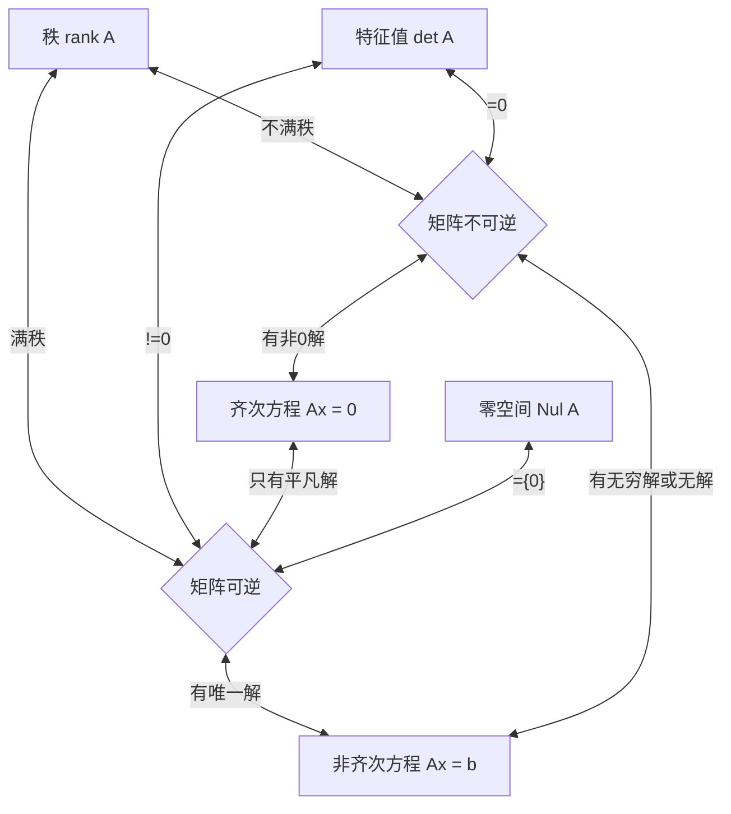

```mermaid
graph TB;
    Ax0[齐次方程 Ax = 0]
    Axb[非齐次方程 Ax = b]
    Det[特征值 det A]
    Nul[零空间 Nul A]
    Rank[秩 rank A]

    Inv{矩阵可逆}
    NInv{矩阵不可逆}

    Rank <--满秩--> Inv
    Rank <--不满秩--> NInv
    Inv <--有唯一解--> Axb
    NInv <--有无穷解或无解--> Axb
    Det <--=0--> NInv
    Det <--!=0--> Inv
    Ax0 <--只有平凡解--> Inv
    NInv <--有非0解--> Ax0
    Nul <--={0}--> Inv
    
```
