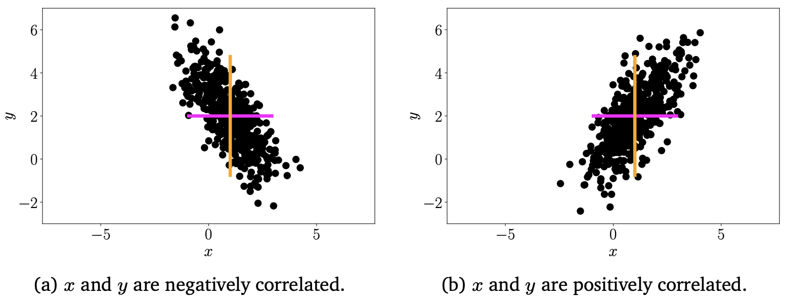

# Chapter 6. 概率论

## Sec 6.1 基本定义

**Sample Space** $\Omega$: 包含随机试验所有可能结果的集合。
例如对于投骰子，$\Omega = \{1, 2, 3, 4, 5, 6\}$。

**Event Space** $\mathcal{A}$：样本空间的所有子集的集合，包括空集和样本空间本身。

**Probability Space** $(\Omega, \mathcal{A}, P)$：包含了样本空间，事件空间和概率的三元组。

**Target Space** $\mathcal{T}$：所有可能的预测结果或标签的集合。它代表了模型输出的所有可能值。元素被称呼为 `state`

$$
P(A)\in [0, 1], P(\Omega) = 1
$$

为避免直接使用概率空间，转而关注感兴趣的量,称为目标空间 $\mathcal{T}$。$\mathcal{T}$ 中的元素被称为 state。

**Random Variable**: $X: \Omega \rightarrow \mathcal{T}$ 是一个函数，将样本空间中的元素映射到目标空间中的元素。

对于一组属于目标空间的情况 $S\subseteq \mathcal{T}$，即其可以定义了 $\{\omega \in \Omega: X(\omega)\in S\}$

如若定义 $X^{-1}: \mathcal{T} \to \Omega$，则有

$$
P_X(S) = P(X \in S) = P(X^{-1}(S)) = P(\{\omega \in \Omega: X(\omega)\in S\})
$$

## Sec 6.2 Discrete & Continuous Prob.

### Discrete Probability

**Probability Mass Function, PMF, 概率质量函数**：如果 $\mathcal{T}$ 是离散空间，则 $x\in \mathcal{T}, P(X= x)$ 表示 $X$ 取值为 $x$ 的概率。

对于离散概率，其可以表示为 Joint Proability，即 $P(X=x, Y=y) = P(X=x \cap Y = y) = \frac{n_{ij}}{N}$。

### Continuous Probability

**Probability Density Function, PDF, 概率密度函数**：如果 $\mathcal{T}$ 是连续空间，则 。

$$
\text{PDF: } f: \mathbb{R}^D \to \mathbb{R}\\
\forall x \in \mathbb{R}^D, P(x) \in [0, 1] \\
\int_{\mathbb{R}^D} f(x)dx = 1 \\
P(a\leq X \leq b) = \int_a^b f(x)dx \text{  where  } a, b \in \mathbb{R}^D
$$

**Cumulative Distribution Function/CDF, 累积分布函数**：$F_X(x) = P(X\leq x)$，其中 $X = [X_1, X_2, \cdots, X_D]^T, x = [x_1, x_2, \cdots, x_D]^T$。

$$
F_X(x) = \int_{-\infty}^{x_1}\cdots\int_{-\infty}^{x_D} F_X(z_1, \cdots, z_D)dz_1\cdots dz_D
$$

Naive Bayes

$$
\underbrace{P(x|y)}_{\text{Posterior}} = \frac{\overbrace{P(y|x)}^{\text{Likelihood}}\overbrace{P(x)}^{\text{Prior}}}{\underbrace{P(y)}_{\text{Evidence}}}
$$

## 6.4 数学期望

$$
\mathbb{E}_X[g(x)] = \int_{\mathcal{X}} g(x)f(x)dx\\
\mathbb{E}_X[g(x)] = \sum_{x\in \mathcal{X}} g(x)f(x)dx\\

\mathbb{E}_X[g(\mathbf{x})] = \begin{bmatrix}
\mathbb{E}_X[g(x_1)]\\
\mathbb{E}_X[g(x_2)]\\
\vdots\\
\mathbb{E}_X[g(x_D)]
\end{bmatrix}
\in \mathbb{R}^D
$$

对于 $\mathbf{x} \in \mathbb{R}^D$，其均值

$$
\text{Mean}_X(x) = 
\mathbb{E}_X[\mathbf{x}] = \begin{bmatrix}
\mathbb{E}_X[x_1]\\
\mathbb{E}_X[x_2]\\
\vdots\\
\mathbb{E}_X[x_D]
\end{bmatrix}
\\
\mathbb{E}_{X_d}[x_d] := \left\{
\begin{align}
& \int_\mathcal{X} x_d p(x_d) \mathrm{d}x_d \\
& \sum_{x_i \in \mathcal{X}} x_i p(x_d = x_i)
\end{align}
\right.
$$

Linearity 线性性质：$\mathbb{E}[aX + bY] = a\mathbb{E}[X] + b\mathbb{E}[Y]$

**Covarience**: 

$$
\begin{align}
\text{Cov}_{X, Y}[x, y] &:= \mathbb{E}_{X, Y}[(x-\mathbb{E}_X[x])(y-\mathbb{E}_Y[y])] \\
&:= \mathbb{E}_{X, Y}[xy + \mathbb{E}_X[x]\mathbb{E}_Y[y]
- y\mathbb{E}_X[x]  - x\mathbb{E}_Y[y]] \\

&:= \mathbb{E}_{X, Y}[xy + \mathbb{E}_X[x]\mathbb{E}_Y[y]
- \mathbb{E}_{X,Y}[x\mathbb{E}_Y[y]] - \mathbb{E}_{X,Y}[y\mathbb{E}_X[x]]] \\

\end{align}
\\
考虑 \mathbb{E}_Y[y] 和 \mathbb{E}_X[x] 为常数\\

\begin{align}
\text{Cov}_{X, Y}[x, y] 
&:= \mathbb{E}_{X, Y}[xy + \mathbb{E}_X[x]\mathbb{E}_Y[y]
- \mathbb{E}_{X,Y}[x\mathbb{E}_Y[y]] - \mathbb{E}_{X,Y}[y\mathbb{E}_X[x]]] \\
&:= \mathbb{E}_{X, Y}[xy + \mathbb{E}_X[x]\mathbb{E}_Y[y]
- \mathbb{E}_{X}[x]\mathbb{E}_Y[y] - \mathbb{E}_{Y}[y]\mathbb{E}_X[x]]\\
&:= \mathbb{E}_{X, Y}[xy - \mathbb{E}_{X}[x]\mathbb{E}_Y[y] ]\\
&:= \mathbb{E}_{X, Y}[xy] - \mathbb{E}_{X}[x]\mathbb{E}_Y[y]
\end{align}
$$

即

$$

\begin{align}
\text{Cov}_{X, Y}[x, y] &:= \mathbb{E}_{X, Y}[(x-\mathbb{E}_X[x])(y-\mathbb{E}_Y[y])] \\
&:= \mathbb{E}_{X, Y}[xy] - \mathbb{E}_{X}[x]\mathbb{E}_Y[y]
\end{align}
$$

对于多维情况，有

$$
\mathbf{x}\in \mathbb{R}^D, \mathbf{y}\in \mathbb{R}^E\\
\text{Cov}_{X, Y}[\mathbf{x}, \mathbf{y}] = \mathbb{E}_{X, Y}[\mathbf{x}\mathbf{y}^T] - \mathbb{E}_{X}[\mathbf{x}]\mathbb{E}_Y[\mathbf{y}]^T = \text{Cov}_{X, Y}[\mathbf{y}, \mathbf{x}]^T \in \mathbb{R}^{D\times E}
$$

**Varience**: 
$$
\begin{align}
\mathbb{V}_X(x) = \text{Var}[X] &= \text{Cov}_X[x, x]\\
&= \mathbb{E}[(x-\mu)(x-\mu)^T]\\
&= \mathbb{E}[xx^T] - \mathbb{E}[x]\mathbb{E}[x]^T
&=
\begin{bmatrix}
    \text{Conv}[x_1, x_1] & \text{Conv}[x_1, x_2] & \cdots & \text{Conv}[x_1, x_D]\\
    \text{Conv}[x_2, x_1] & \text{Conv}[x_2, x_2] & \cdots & \text{Conv}[x_2, x_D]\\
    \vdots & \vdots & \ddots & \vdots\\
    \text{Conv}[x_D, x_1] & \text{Conv}[x_D, x_2] & \cdots & \text{Conv}[x_D, x_D]\\
\end{bmatrix}

\end{align}

$$

将两个变量的数据点绘制在二维坐标系中，协方差实际上反映了这些点形成的"椭圆云"的形状和方向。
- 正协方差表示椭圆主轴倾向于从左下到右上
- 负协方差则相反。

协方差的绝对值越大，椭圆越细长；接近于0时，则更接近圆形。

方差可以看作是协方差的特殊情况 - 即变量与自身的协方差。在几何上,这相当于将二维椭圆投影到对应的轴上。

**Correlation**：
$$

\textrm{Corr}[x, y] = \frac{\textrm{Cov}[x, y]}{\sqrt{\mathbb{V}[x]\mathbb{V}[y]}}\in[-1, 1]
$$

相关系数是协方差除以两个变量标准差的乘积,可以理解为"标准化"后的协方差。它的值介于-1到1之间,反映了椭圆的"瘦长"程度。

上述描述通常用于表示实际统计学中的数据集。但是我们无法实现真正意义上的统计学，我们可以对已观测到量进行经验（Empirical）估计。

Empirical Mean: 
$$
\bar{x} = \frac{1}{N}\sum_{i=1}^N x_i
$$

Empirical Covarience:

$$
\Sigma = \frac{1}{N}\sum_{n=1}^N (x_n - \bar{x})(x_n - \bar{x})^T
$$

### 不同方差的表示

$$
\mathbb{V}_X[x] = \mathbb{E}_X[(x-\mu)^2]
$$

标准定义直观但需要两次遍历数据（先计算平均值，再计算方差）。

raw-score raw-score formula for variance
$$
\mathbb{V}_X[x] = \mathbb{E}_X[x^2] - \mathbb{E}_X[x]^2
$$
原始分数公式只需一次遍历，但可能有数值稳定性问题。

$$
\frac{1}{N^2} \sum_{i,j=1}^{N} (x_i - x_j)^2 = 2 \left[ \frac{1}{N} \sum_{i=1}^{N} x_i^2 - \left( \frac{1}{N} \sum_{i=1}^{N} x_i \right)^2 \right]
$$

成对差异和提供了一个几何解释，表明方差可以通过计算点对之间的距离或点与中心的距离来理解。