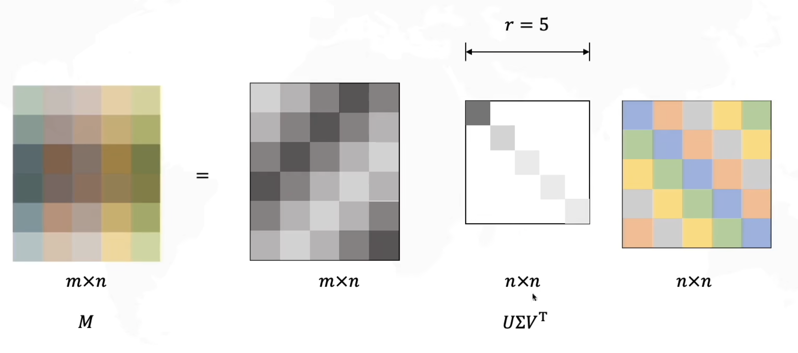

# SVD 分解

对于一组标准正交基 $V$，我们可以把线性变换 $M$ 分解为三个矩阵的乘积：

$$
M = U \Sigma V^T
$$

其原型为

$$
MV = U\Sigma
$$

$M$：线性变换  
$U$：旋转变换，left singular vectors  
$\Sigma$：拉伸变换，对角矩阵，singular values  
$V$：原始域的标准正交基，right singular vectors

考虑正交矩阵特性 $V^T = V^{-1}$，我们可以得到

$$
\begin{align}
MV &= U\Sigma\\
M &= U\Sigma V^{-1}\\
M &= U\Sigma V^T\\
(m\times n) &= (m\times m)(m\times n)(n\times n)
\end{align}
$$

即，旋转，缩放，旋转

## 参数

$U, V$ 都是正交矩阵，即 $U^TU = I, V^TV = I$  
$\Sigma$ 是对角矩阵：

$$
\Sigma = \begin{bmatrix}
\sigma_1 & 0 & 0 & \cdots & 0\\
0 & \sigma_2 & 0 & \cdots & 0\\
0 & 0 & \sigma_3 & \cdots & 0\\
\vdots & \vdots & \vdots & \ddots & \vdots\\
0 & 0 & 0 & \cdots & \sigma_n
\end{bmatrix}
$$

其中  $\sigma_1 \geq \sigma_2 \geq \cdots \geq \sigma_n \geq 0$

如果我们考虑整个分解为

$$
\begin{bmatrix}
| & | & \vdots & & |\\
\mathbf{x}_1 & \mathbf{x}_2 & \mathbf{x}_3 & \cdots & \mathbf{x}_n\\
| & | & \vdots & & |
\end{bmatrix}
=
\begin{bmatrix}
| & | & \vdots & & |\\
\mathbf{u}_1 & \mathbf{u}_2 & \mathbf{u}_3 & \cdots & \mathbf{u}_n\\
| & | & \vdots & & |
\end{bmatrix}

\begin{bmatrix}
\sigma_1 &           &  & 0\\
         & \sigma_2  & &\\
         &           & \ddots & \\
0        &           &  & \sigma_m \\
-        &    -      & -&-\\
\end{bmatrix}
\begin{bmatrix}
- & \mathbf{v}_1 & -\\
- & \mathbf{v}_2 & -\\
 & \vdots & \\
- & \mathbf{v}_m & -
\end{bmatrix}
$$

我们可以认为 $\Sigma$ 本质上是重要程度，其表示 $v_i$ 和 $u_i$ 的重要程度，$i$ 越小，重要程度越高。

上式可以被转化为

$$
\begin{align}
X &= \sigma_1u_1v_1^T + \sigma_2u_2v_2^T + \cdots + \sigma_mu_mv_m^T\\
&= \sum_{i=1}^{m}\sigma_iu_iv_i^T
\end{align}
$$

如考虑上述情况，我们可以，我们可以将本来 $m$ 项的求和切断(truncate)称 $r$ 项（$\text{rank } X$），因此我们可以获得一个近似的 $X$，我们称其为 economy SVD
$X = U\Sigma V^T  \approx \tilde{U}\tilde{\Sigma}\tilde{V}$

其本质在描述如下过程：

## 求解 SVD

对于 $M = U\Sigma V^T$，我们可以通过以下步骤求解：

$$
\begin{align}
M^TM &= (U\Sigma V^T)^T(U\Sigma V^T)\\
&= V\Sigma^TU^TU\Sigma V^T\\
&= V\Sigma^T\Sigma V^T\\
&= V\Sigma^2V^T
\end{align}
$$

令 $L=\Sigma^2$，则有；

$$
\begin{align}
M^TM &= VLV^T\\
M^TMV &= VL
\end{align}
$$

$$
\begin{align}
MM^T &= (U\Sigma V^T)(U\Sigma V^T)^T\\
&= U\Sigma V^TV\Sigma^TU^T\\
&= U\Sigma\Sigma^TU^T\\
&= ULU^T\\
MM^TU &= UL
\end{align}
$$

即我们有

$$
M^TMV = VL\\
MM^TU = UL
$$

我们求 $M^TM$ 的特征值 $\lambda_i$ 和特征向量 $v_i$，则有

$$
M^TM v_1 = \lambda_1 v_1\\
M^TM v_2 = \lambda_2 v_2\\
\cdots\\
M^TM v_n = \lambda_n v_n\\
\Downarrow\\
M^TM \underbrace{
\begin{bmatrix}
| & | &  & |\\
v_1 & v_2 & \cdots & v_n\\
| & | &  & |
\end{bmatrix}}_{V}
=
\underbrace{ 
\begin{bmatrix}
\lambda_1 & & &0\\
& \lambda_2 & &\\
& & \ddots &\\
0& & & \lambda_n
\end{bmatrix}}_{L}
\underbrace{
\begin{bmatrix}
| & | &  & |\\
v_1 & v_2 & \cdots & v_n\\
| & | &  & |
\end{bmatrix}}_{V}
$$

即 $V$ 为 $M^TM$ 的特征向量矩阵，$\Sigma = \sqrt{L}$。
类似的，我们可以求解 $MM^T$ 的特征值 $\lambda_i$ 和特征向量 $u_i$，则有 $U$ 为 $MM^T$ 的特征向量矩阵。
## 参考

- [【学长小课堂】什么是奇异值分解SVD--SVD如何分解时空矩阵](https://www.bilibili.com/video/BV16A411T7zX/)
- [奇异值分解的工程应用Singular Value Decomposition (SVD) Steven](https://www.bilibili.com/video/BV1Y44y1D7P8)